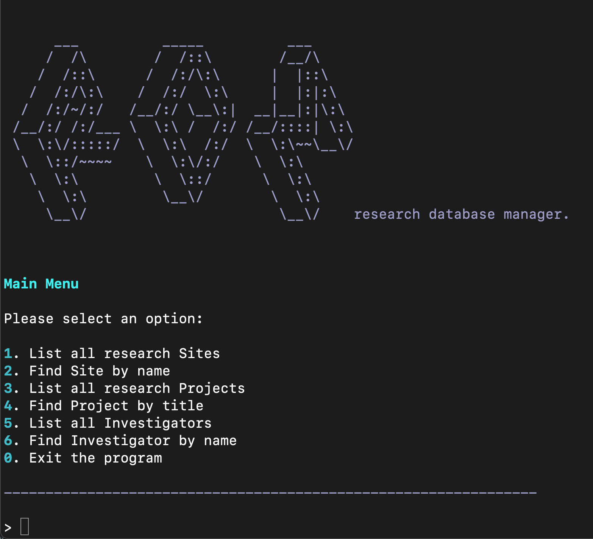
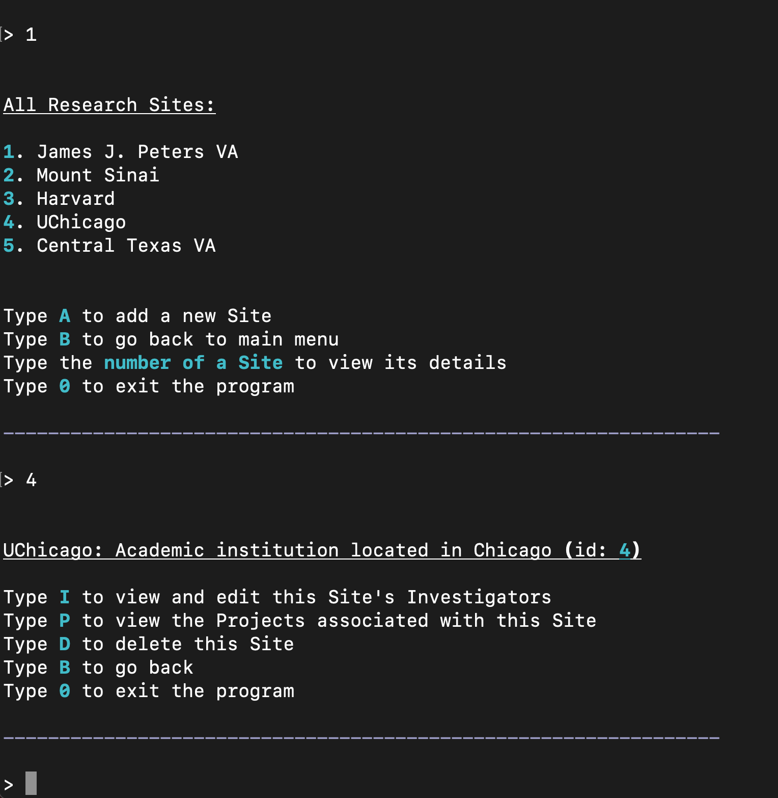
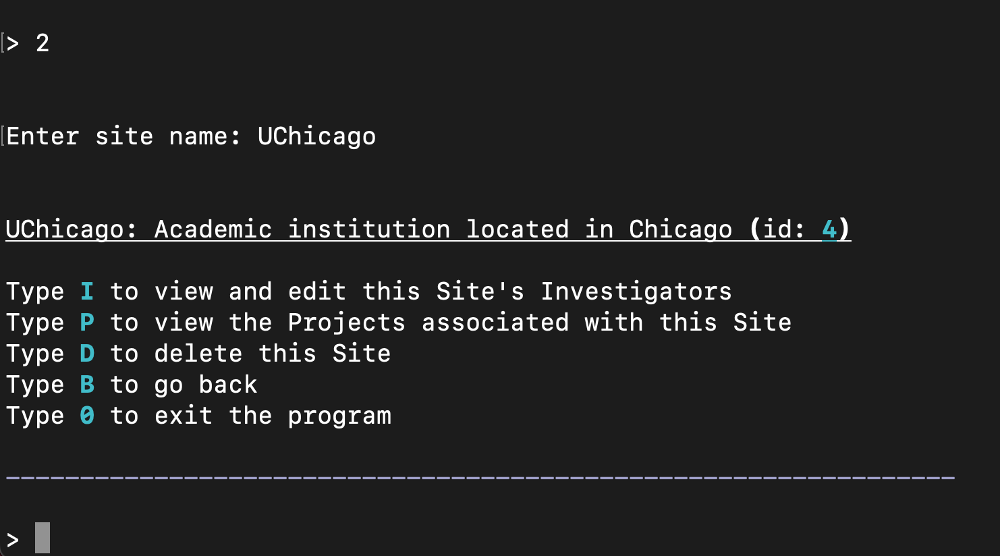
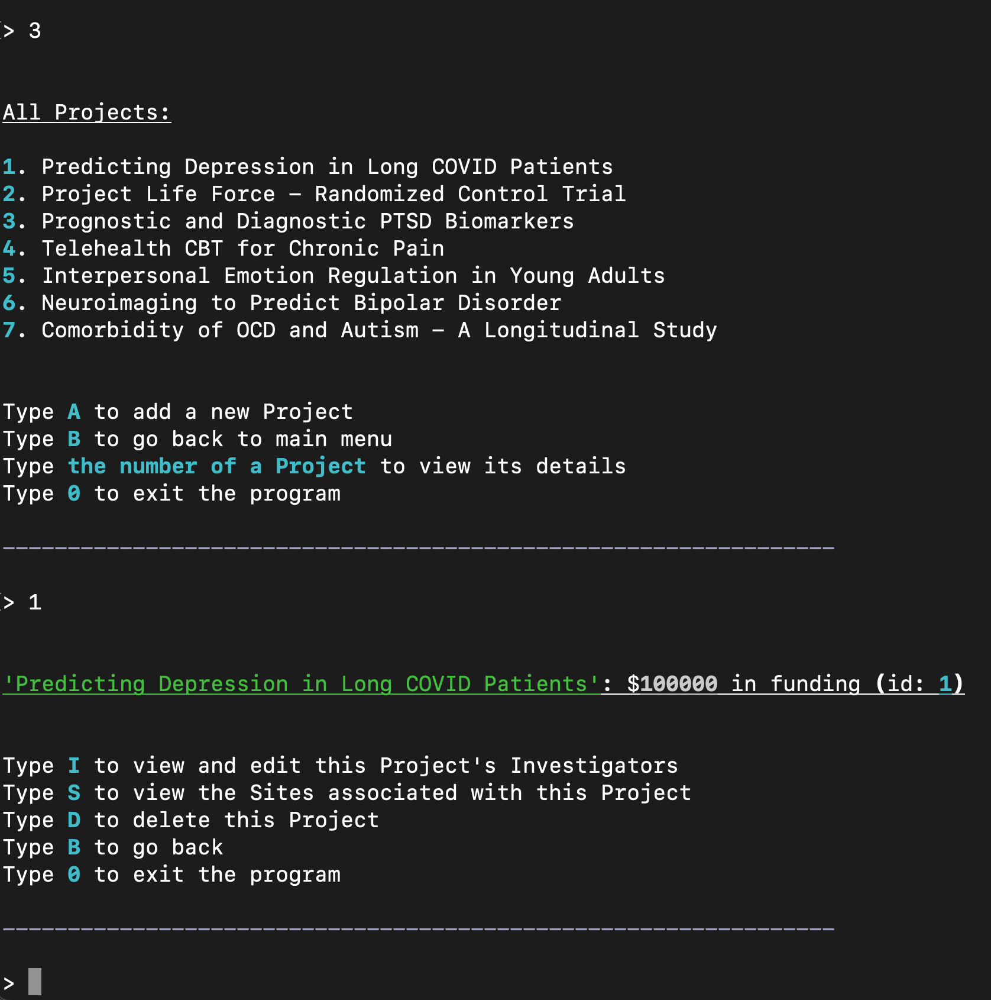
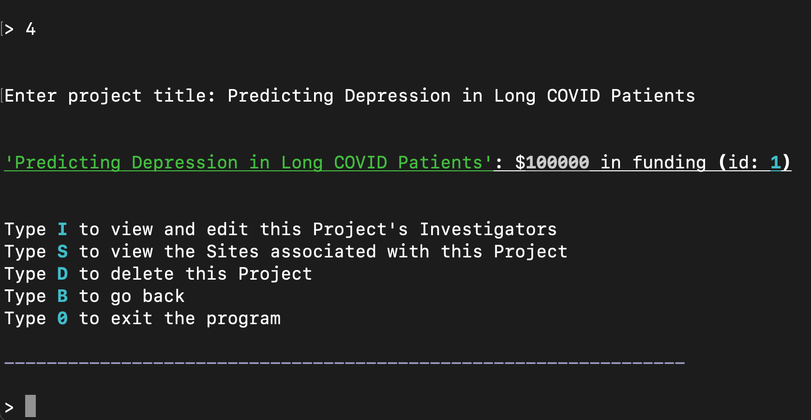
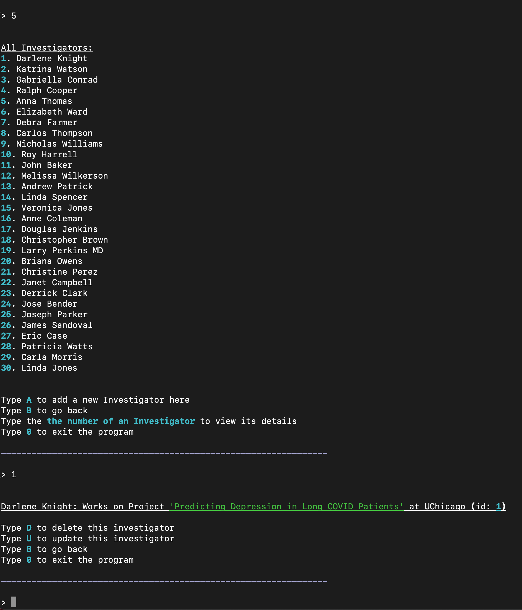
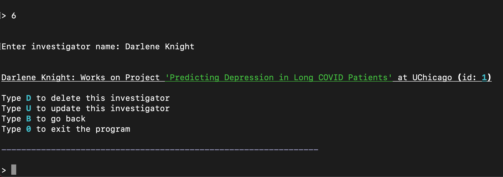
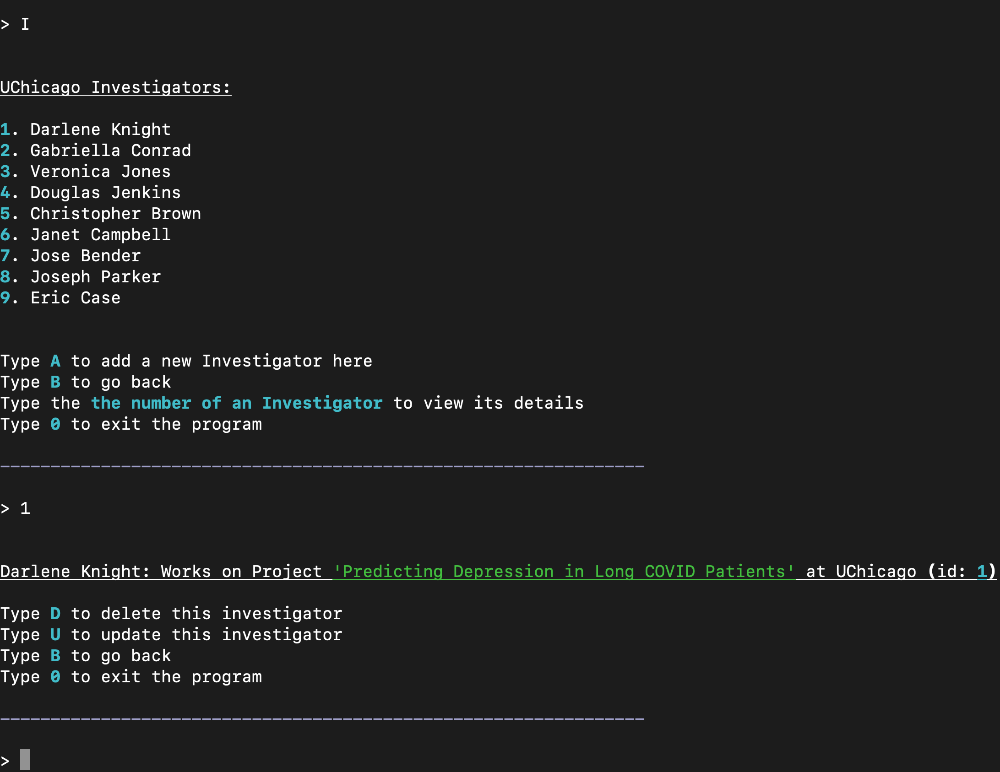
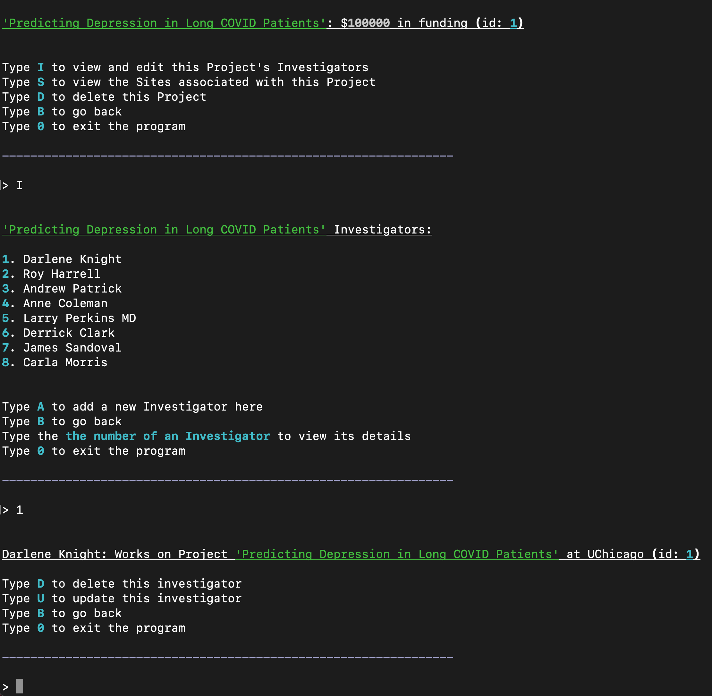

# RDM (research database manager.)

## Overview

          ___          _____          ___
         /  /\        /  /::\        /__/\
        /  /::\      /  /:/\:\      |  |::\
       /  /:/\:\    /  /:/  \:\     |  |:|:\
      /  /:/~/:/   /__/:/ \__\:|  __|__|:|\:\
     /__/:/ /:/___ \  \:\ /  /:/ /__/::::| \:\
     \  \:\/:::::/  \  \:\  /:/  \  \:\~~\__\/
      \  \::/~~~~    \  \:\/:/    \  \:\
       \  \:\         \  \::/      \  \:\
        \  \:\         \__\/        \  \:\
         \__\/                       \__\/    research database manager.

RDM (research database manager.) is a command line application that allows users to manage research sites, projects, and investigators. This project was inspired by my prior experience working in academic, government, and medical settings to conduct psychological research. Both research sites and projects can include many investigators, but an investigator may only work on one project at one site.

You can run the file `cli.py` to start up the CLI. This file first seeds the database with sample data, then allows users to navigate the project.

## Demo

[Here](https://www.youtube.com/watch?v=JrtR0XUZG3Y) is a video demonstrating the usage of RDM.

## Command Line Menus

Users have the ability to view and search through all 3 models (Sites, Projects, Investigators) from the main menu of the application.

### Sites

Below demonstrates the two ways in which a user can begin looking through the research sites from the main menu: 1. Listing all sites, or 2. Searching for a particular site by name. If viewing all sites, you may also create a new site with the name, classification, and city of your choosing.

  
  &nbsp; &nbsp; &nbsp; &nbsp; &nbsp; &nbsp; &nbsp; &nbsp;
   

Once on a site, users can view and edit its investigators, delete the site, or view the titles of its associated projects as a bonus. Sites and Projects have a many to many relationship through Investigators. Many projects can be worked on at one site, and many sites can collaborate on one project.

&nbsp;

### Projects

Similar to sites, users can look through projects from the main menu by selecting from all projects or searching by title directly:

  
  &nbsp; &nbsp; &nbsp; &nbsp; &nbsp; &nbsp; &nbsp; &nbsp;
   

Projects have the same menu options as sites where a user can view/edit its investigators, delete projects, or view the names of its sites. If a site or project is deleted, so are its investigators. This is similar to a company or initiative firing its employees before desolving itself.

&nbsp;

### Investigators

Lastly from the main menu, users can view all investigators and select from the list or search by name directly.

  
  &nbsp; &nbsp; &nbsp; &nbsp; &nbsp; &nbsp; &nbsp; &nbsp;
  

While viewing an investigator, you can delete them or update their site, project, and name. If you were to select an investigator from within a site or project (rather than searching by name or selecting from the full list), you will be navigated to the same investigator page.

|            From a Site            |            From a Project            |
| :-------------------------------: | :----------------------------------: |
|  |  |

## Helper Functions

`helpers.py` contains numerous helper functions that support the CLI interactivity. Below is an overview of these functions:

`exit_program()` exits the program when a user selects 0 at any point during the program.

--

`all_sites()` prompts users for choices that trigger other functions involving sites, after all sites are rendered in the terminal.

`all_sites_menu()` displays a menu of options when the user is viewing a list of all sites.

`site_details()` displays the details for a site and prompts the user for follow-up input, passing those values to other functions.

`site_details_menu()` displays a menu of options when the user is viewing one site.

`list_sites(sites)` prints a formatted list of sites provided as a parameter.

`add_site()` prompts the user for site details and creates a new site in the database.

`find_site_by_name()` prompts the user for a name and calls a class method to search the database for that site.

`site_projects(site)` calls helper functions to display a menu of options and print the projects associated with the given site. Prompts the user for follow-up input.

--

`investigators(site=None, project=None)` prompts users for choices that trigger other functions involving investigators, after all investigators are displayed in the terminal. Investigators are displayed based on whether one is viewing them from within a site, project, or the full investigator list.

`investigators_menu()` displays a menu of options when the user is viewing a list of investigators.

`investigator_details()` displays the details for an investigator and prompts the user for follow-up input, passing those values to other functions.

`investigator_details_menu()` displays a menu of options when the user is viewing one investigator.

`list_investigators(investigators)` prints a formatted list of investigators provided as a parameter.

`add_investigator(site=None, project=None)` prompts the user for investigator details and creates a new investigator in the database. `site` and `project` parameters help determine whether to add the investigator to a given site or project, or whether the user needs to supply both.

`update_investigator(investigator)` prompts the user for new investigator details and persists those changes to the database.

`find_investigator_by_name()` prompts the user for a name and calls a class method to search the database for that investigator.

--

`all_projects()` prompts users for choices that trigger other functions involving projects, after all projects are displayed in the terminal.

`all_projects_menu()` displays a menu of options when the user is viewing a list of all projects.

`project_details()` displays the details for a project and prompts the user for follow-up input, passing those values to other functions.

`project_details_menu()` displays a menu of options when the user is viewing one project.

`list_projects(projects)` prints a formatted list of projects provided as a parameter.

`add_project()` prompts the user for project details and creates a new project in the database.

`find_project_by_title()` prompts the user for a title and calls a class method to search the database for that project.

`project_sites(project)` calls helper functions to display a menu of options and print a project's sites. Prompts the user for follow-up input.

--

`projects_sites_menu()` displays a menu of options when viewing the Sites/Projects many-to-many relationship (projects associated with a site or sites associated with a project).

&nbsp;

## Models

Behind the scenes, this project is using 3 classes/models to manage the functionality of and relationships between sites, investigators, and projects. The models have many of the same methods.

### Site

`sites.py` contains the `Site` class which is responsible for the functionality of all `Site` objects. It includes the properties `name`, `city`, and `classification` which are validated whenever updated. It also includes methods to create and drop the 'sites' table, create a `Site`, update a `Site`, delete a `Site`, get all `Sites`s, find a `Site` by name or id, and display its investigators or projects. It also includes a method to create a `Site` from a row of the database (for use in other methods).

Here is an example of a `Site` printed: "Site 1: James J. Peters VA | Bronx | Government institution"

### Investigator

`investigators.py` contains the `Investigator` class which is responsible for the functionality of all `Investigator` objects. It includes the properties `name`, `site_id`, and `project_id` which are validated whenever updated. It also includes methods to create and drop the 'investigators' table, create an `Investigator`, update an `Investigator`, delete an `Investigator`, get all `Investigator`s, and find an `Investigator` by name or id. It also includes a method to create an `Investigator` from a row of the database (for use in other methods).

Here is an example of an `Investigator` printed: "Investigator 1: Jack Taylor | Site 4 | Project 3"

### Project

`projects.py` contains the `Project` class which is responsible for the functionality of all `Project` objects. It includes the properties `title` and `funding` which are validated whenever updated. It also includes methods to create and drop the 'projects' table, create a `Project`, update a `Project`, delete a `Project`, get all `Project`s, find a `Project` by name or id, and display its investigators or sites. It also includes a method to create a `Project` from a row of the database (for use in other methods).

Here is an example of a `Project` printed: "Project 1: Predicting Depression in Long COVID Patients | $100000 in funding"
