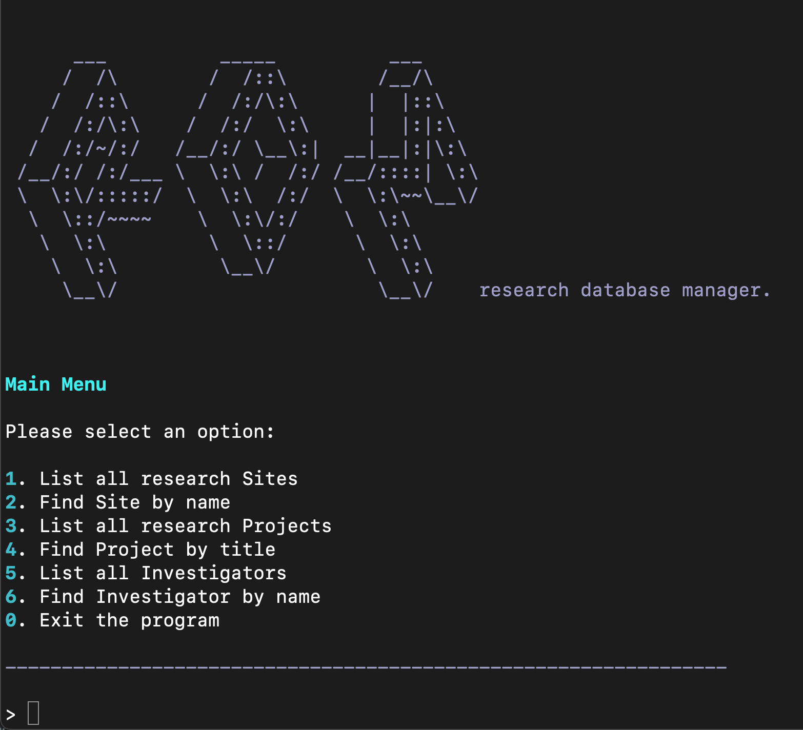
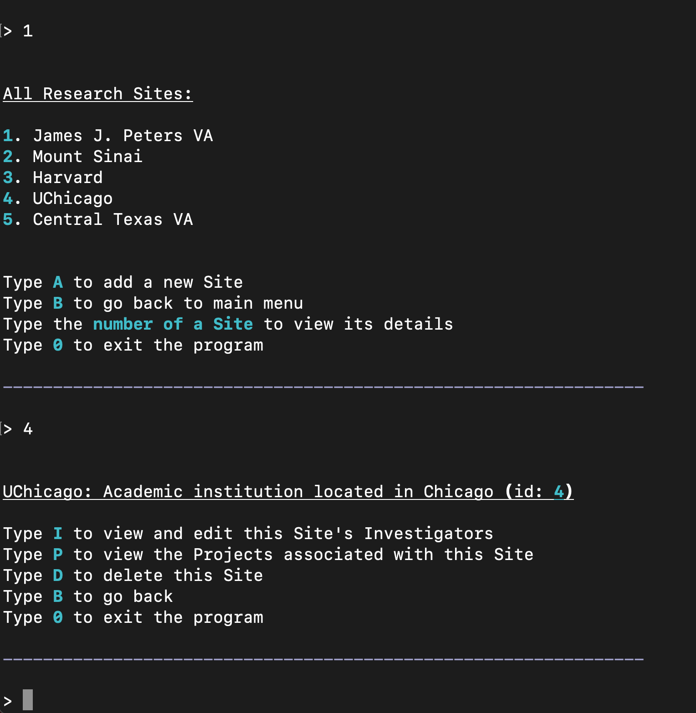
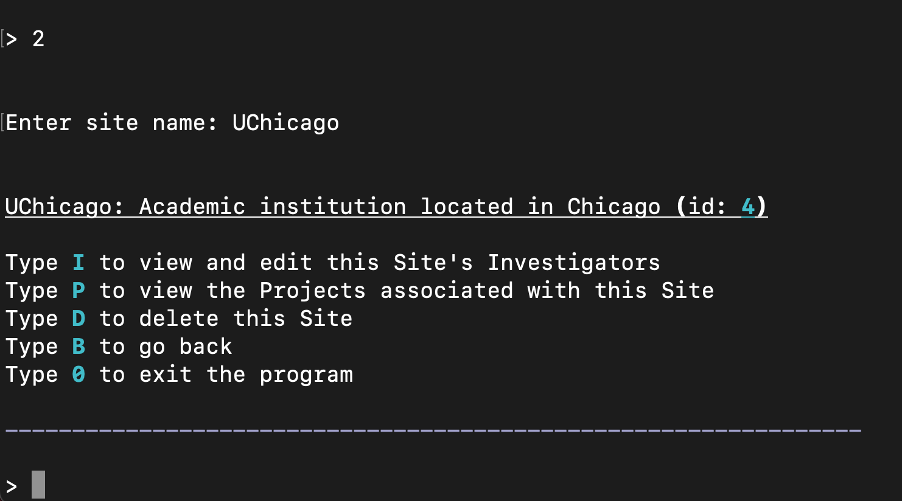
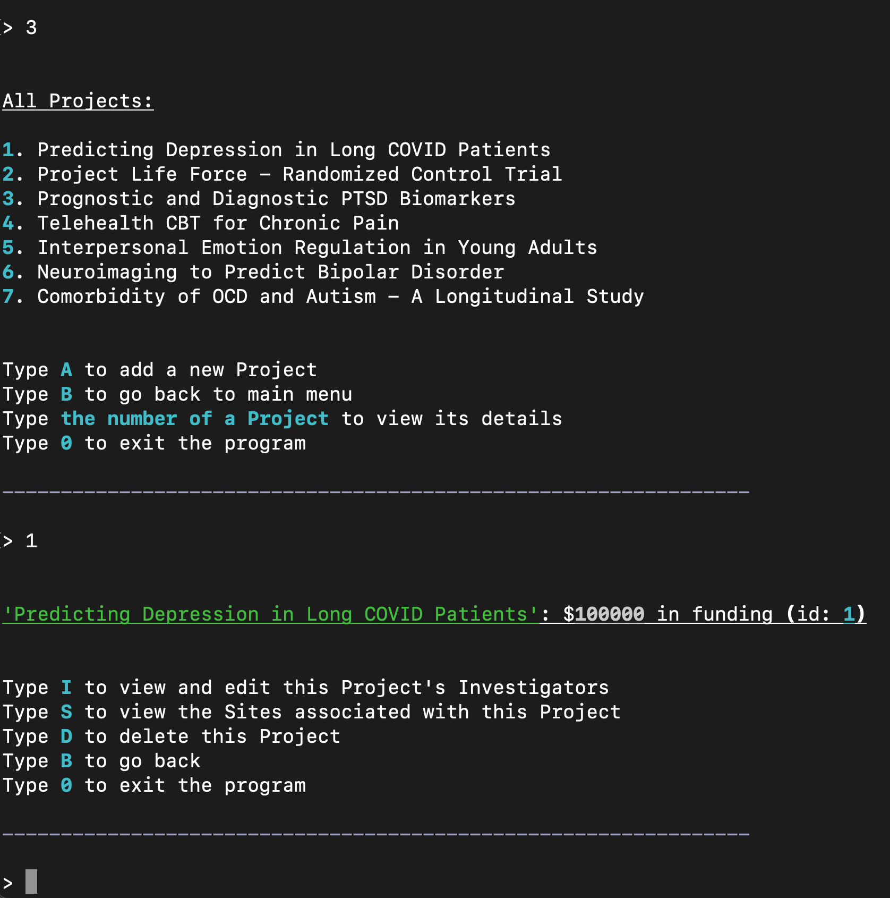
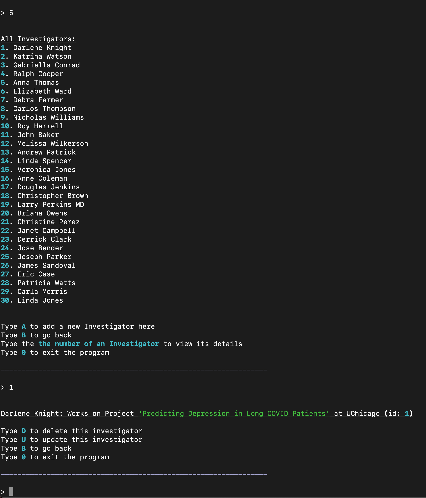
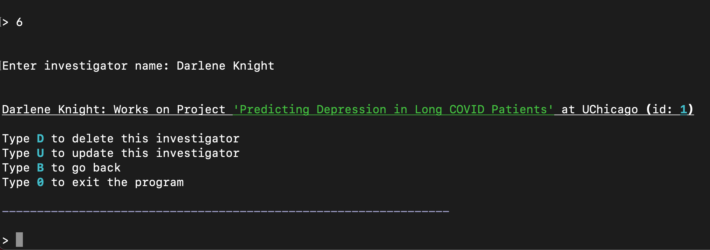
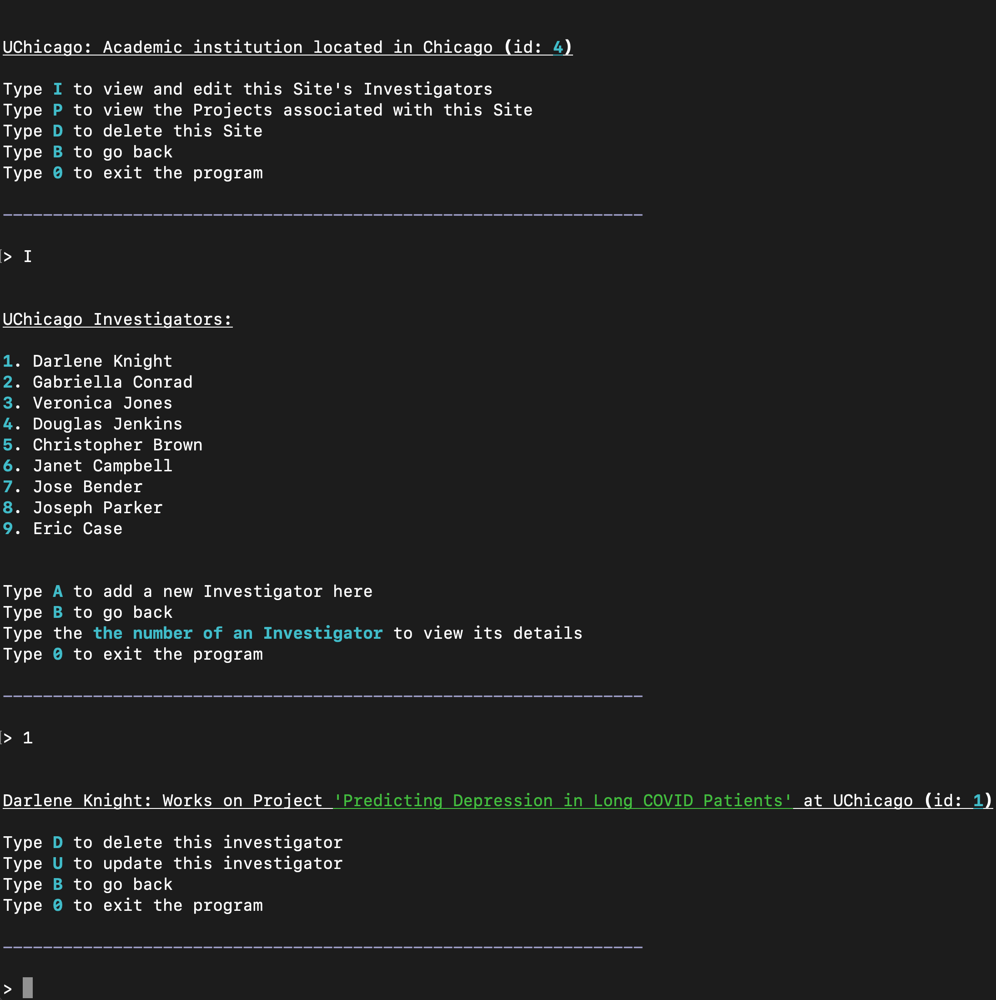
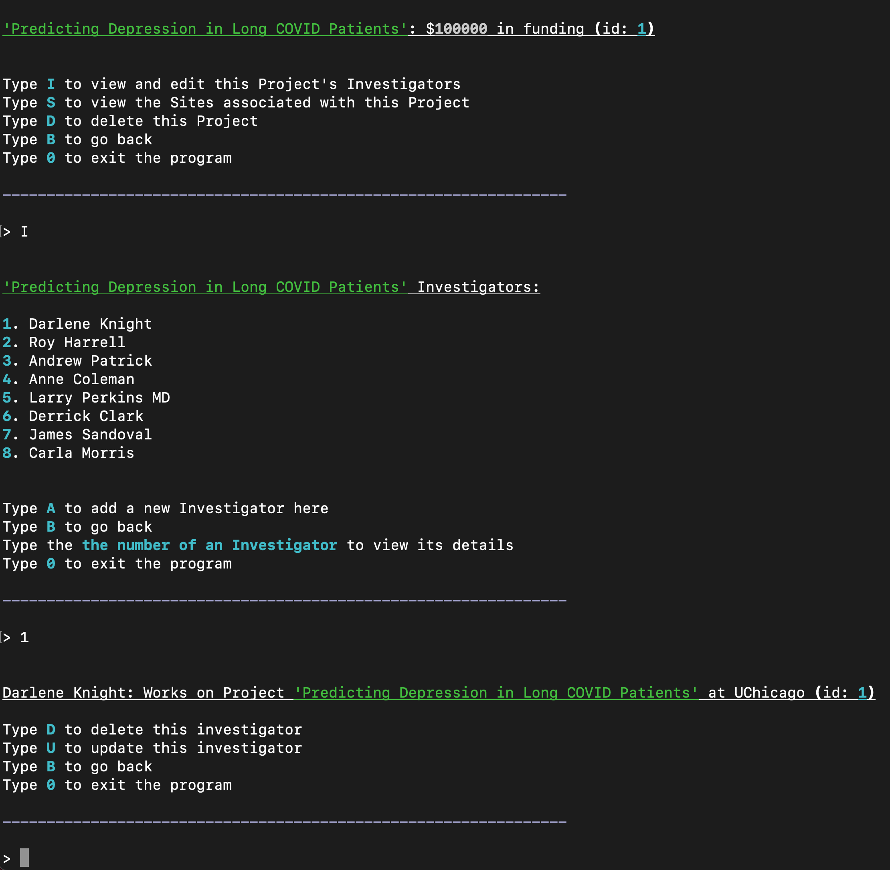

# Phase 3 Project - RDM

## Overview

&nbsp;

RDM (research database manager.) is a command line application that allows users to manage research sites, projects, and investigators. This project was inspired by my prior experience working in academic, government, and medical settings to conduct psychological research. Both research sites and projects
can include many investigators, but an investigator may only work on one project at one site.

You can run the file `cli.py` to start up the CLI. This file first seeds the database with some sample data, but users are able to modify this data while using the application.

## Command Line Menus

Users have the ability to view and search through all 3 models (Sites, Projects, Investigators) from the main menu of the application.

### Sites

Below demonstrates the two ways in which a user can begin looking through the research sites from the main menu: 1. Listing all sites, or 2. Searching for a particular site by name. If viewing all sites, you may also create a new site with the name, classification, and city of your choosing.

  
  &nbsp; &nbsp; &nbsp; &nbsp; &nbsp; &nbsp; &nbsp; &nbsp;
   

Once on a site, users can view and edit its investigators, delete the site, or view the titles of its associated projects as a bonus. Sites and Projects have a many to many relationship through Investigators. Many projects can be worked on at one site, and many sites can collaborate on one project.

&nbsp;

### Projects

Similar to sites, users can look through projects from the main menu by selecting from all projects or searching by title directly:

  
  &nbsp; &nbsp; &nbsp; &nbsp; &nbsp; &nbsp; &nbsp; &nbsp;
   

Projects have the same menu options as sites where a user can view/edit its investigators, delete projects, or view the names of its sites. If a site or project is deleted, so are its investigators. This is similar to a company or initiative firing its employees before desolving itself.

&nbsp;

### Investigators

Lastly from the main menu, users can view all investigators and select from the list or search by name directly.

  
  &nbsp; &nbsp; &nbsp; &nbsp; &nbsp; &nbsp; &nbsp; &nbsp;
  

While viewing an investigator, you can delete them or update their site, project, and name. If you were to select an investigator from within a site or project (rather than searching by name or selecting from the full list), you will be navigated to the same investigator page.

|              From a Site              |              From a Project               |
| :-----------------------------------: | :---------------------------------------: |
|  |  |
